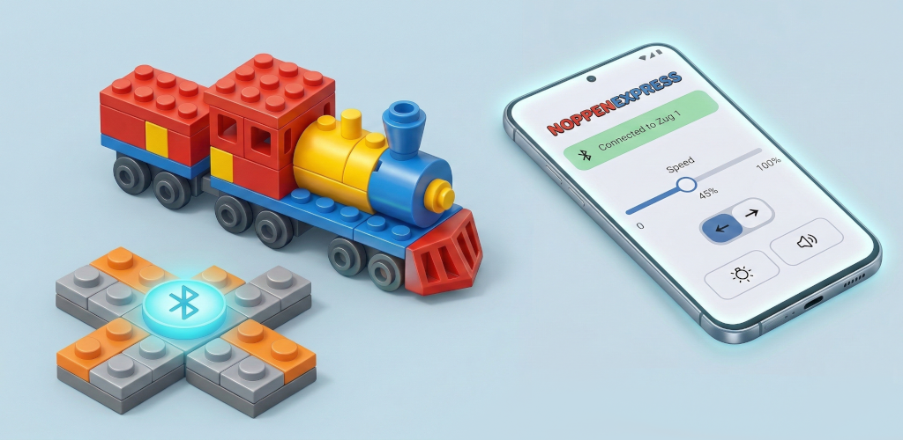
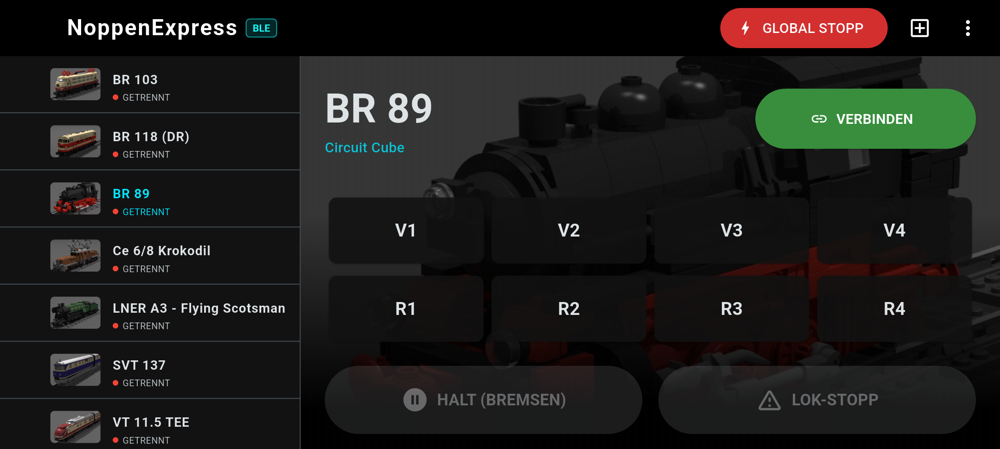
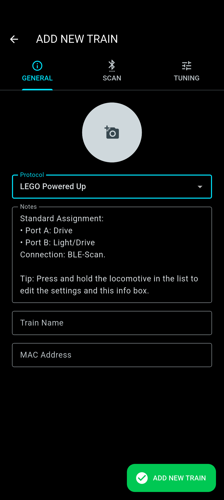

# NoppenExpress (BLE) 🚂💨
**Bedienungsanleitung / Manual** *(c) 2026 graefemeister@gmail.com*

---

## 🇩🇪 DEUTSCH
### Willkommen bei NoppenExpress!
Deine neue, smarte Schaltzentrale für Bluetooth-gesteuerte Klemmbaustein-Züge. Egal ob Rangierfahrt oder High-Speed, mit NoppenExpress hast du die volle Kontrolle.

### 🛠 DIE WERKSTATT (Loks anlegen)
Nutze das **'+' Symbol**, um eine neue Lok anzulegen:
* **Bluetooth Scan:** Findet die MAC-Adresse deines Hubs (Mould King 6.0, LEGO® Hub, Circuit Cube oder andere) automatisch.
* **Personalisierung:** Gib der Lok einen Namen, lade ein eigenes Foto hoch und hinterlege Wartungs-Notizen.
* **Tuning:** Passe die 4 Fahrstufen (V1-V4) an, setze ein Limit für Rückwärtsfahrten oder konfiguriere das Ramping für besonders weiches Anfahren und Bremsen.

### 🕹 DAS STEUERPULT
Wähle eine Lok aus der seitlichen Liste, um sie zu verbinden:
* **Fahrstufen:** Nutze V1-V4 (Vorwärts) und R1-R4 (Rückwärts).
* **Ramping (Halt):** Die orangefarbene Taste bremst deine Lok sanft und realistisch bis zum Stillstand ab.
* **Zubehör:** Schalte die Lichter (Port B/C) bequem um.
* **Invertieren:** Fährt die Lok in die falsche Richtung? "Richtung Invertieren" löst das Problem sofort.

### ⚠️ SICHERHEIT GEHT VOR
* **Lok-Stopp:** Der rote Button im Steuerpult stoppt die aktuell gewählte Lok **SOFORT** (ohne Bremsverzögerung).
* **Global Stop:** Der große rote Button oben in der Menüleiste sendet einen Nothalt an **ALLE** aktuell verbundenen Loks.

### ⚙️ EINSTELLUNGEN & BACKUP
Im Dreipunkte-Menü findest du nützliche Extras:
* **Backup:** Exportiere all deine Loks als JSON-Datei, um sie auf einem anderen Gerät wieder zu importieren.
* **Darstellung:** Aktiviere den Darkmode oder skaliere die Buttons größer.
* **Wakelock:** Verhindert, dass dein Display während der Fahrt unerwünscht ausgeht.

---

## 🇺🇸 ENGLISH
### Welcome to NoppenExpress!
Your new, smart command center for Bluetooth-controlled brick trains. Whether shunting or running express, NoppenExpress gives you total control over your layout.

### 🛠 THE WORKSHOP (Adding Trains)
Tap the **'+' icon** to add a new train to your roster:
* **Bluetooth Scan:** Automatically finds the MAC address of your hub (Mould King, LEGO® Hub, Circuit Cube or others).
* **Personalization:** Give your train a name, upload a custom photo, and save maintenance notes.
* **Tuning:** Customize the speeds for the 4 gears (V1-V4), set a reverse limit, or configure the ramping steps for buttery-smooth acceleration.

### 🕹 THE CONTROL PANEL
Select a train from the sidebar to connect:
* **Gears:** Use buttons V1-V4 (Forward) and R1-R4 (Reverse).
* **Ramping (Halt):** The orange button slows your train down gently and realistically until it stops.
* **Accessories:** Toggle the lights (Ports B and C).
* **Invert:** A quick tap on "Invert Direction" solves orientation issues instantly.

### ⚠️ SAFETY FIRST
* **Train Stop:** The red button on the control panel stops the currently selected train **IMMEDIATELY**.
* **Global Stop:** The large red button in the top menu bar instantly sends an emergency stop signal to **ALL** currently connected trains.

### ⚙️ SETTINGS & BACKUP
You will find useful extras in the three-dot menu:
* **Backup:** Export all your trains to a JSON file to import them onto another device.
* **Appearance:** Activate Dark Mode or scale up the UI buttons.
* **Wakelock:** Prevents your screen from turning off unexpectedly while driving.
